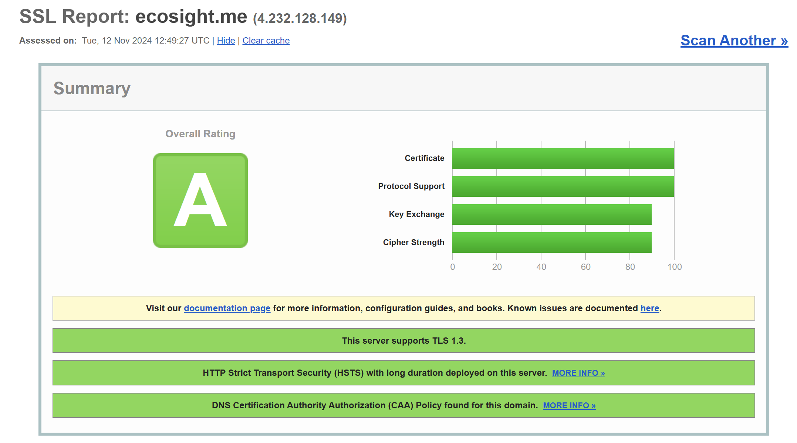

# EcoSight

## Table of Contents
- [Introduction](#introduction)
- [Technologies Used](#technologies-used)
- [Functionalities](#functionalities)
- [Demo](#demo)
- [Installation Guide](#installation-guide)
- [Architecture](#architecture)
- [Implementation](#implementation)
- [Deployment Server](#deployment-server)
- [Results](#results)
- [Certification and Grading](#certification-and-grading)

---

## Introduction

**EcoSight** 🌍📱🌿 is a cutting-edge application combining **IoT, cloud computing**, and mobile technologies to deliver real-time plant health analysis and species identification. Designed for biodiversity enthusiasts and researchers, EcoSight leverages **infrared imagery captured via Raspberry Pi** and advanced cloud processing to evaluate the health of plants and classify them based on their species.

With EcoSight, users can:
- Capture infrared images of plants.
- Obtain real-time health indices like NDVI (Normalized Difference Vegetation Index).
- Identify plant species through AI-based classification in the cloud.

This app bridges the gap between advanced ecological monitoring and user accessibility, transforming every user into a biodiversity guardian. All data, including infrared indices, plant species, timestamps, and geolocations, are synchronized to the cloud and presented in an intuitive iOS application. The app also provides a personalized dashboard for users to track their activity and analyze trends.

---

## Technologies Used
- **Infrared Camera (Raspberry Pi NoIR 8MP)**: Captures spectral data for plant health evaluation.
- **Raspberry Pi 4 Model B**: Manages data capture and communication with the cloud.
- **MQTT/REST API**: Facilitates secure data transmission between devices and the cloud.
- **Azure Cloud Services**: Processes infrared indices (e.g., NDVI) and performs CNN-based plant classification.
- **iOS Application (Swift)**: Displays results, including health analysis and historical data.
- **Core Location API**: Captures geolocation data from the user's iPhone.

---

## Functionalities

### iOS Application
1. **Real-Time Interaction**:
   - Displays results immediately after cloud processing.
2. **Personal Dashboard**:
   - Lists plants analyzed, including health indices and species classification.
   - Provides visualizations such as graphs and trends over time.
3. **Data Sharing**:
   - Export data as PDFs or CSVs for research or educational purposes.
   - Share findings on social media platforms.

### Cloud Processing
- **Infrared Data Analysis**:
  - Calculates vegetation health metrics like NDVI.
- **Species Identification**:
  - Utilizes CNN-based models to classify plant species.
- **Data Storage**:
  - Archives images, health indices, and metadata for seamless retrieval.

### IoT Integration
- **Camera Integration**:
  - Uses Raspberry Pi NoIR Camera for capturing infrared images.
- **Seamless Communication**:
  - Sends image data to the cloud with low latency for analysis.

---

## Demo
*To be added later*

---

## Installation Guide
*To be added later*

---

## Architecture
*To be added later*

---

## Implementation
*To be added later*

---

## Deployment Server
*To be added later*

---

## Results
*To be added later*

---

## Certification and Grading

